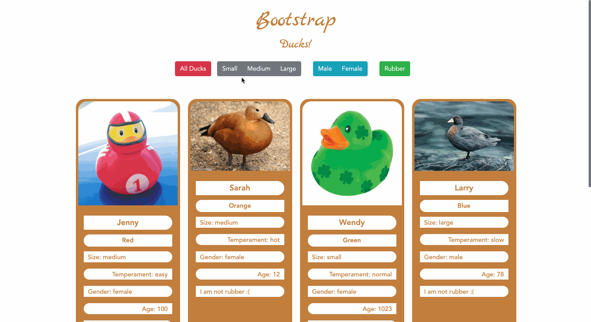

# Bootstrap

This site was built using many Bootstrap features. You will see button groups, cards, and styling all from Bootstrap. An additional feature is the filter option to see a specific size, gender, or type of duck.

### Technologies Used:
**Bootstrap | DOM | Event Listeners**

---

---

#### Backlog

Build a feature that allows the User to have multiple filters used at once. For example, display all "Medium" "Female" ducks.
